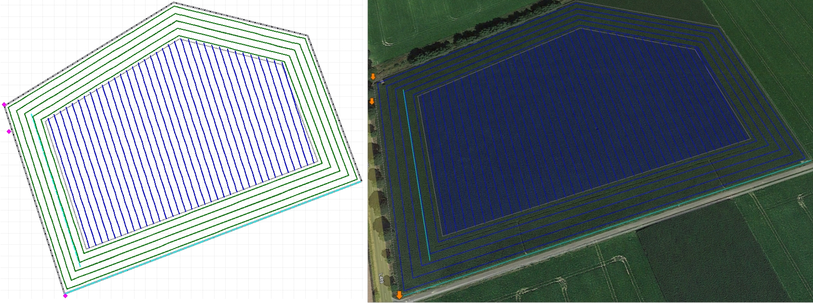
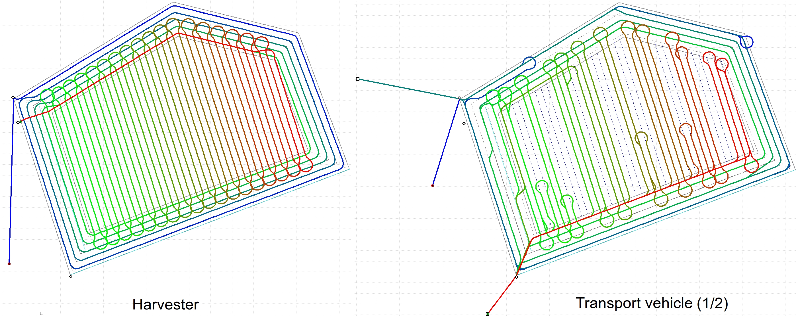
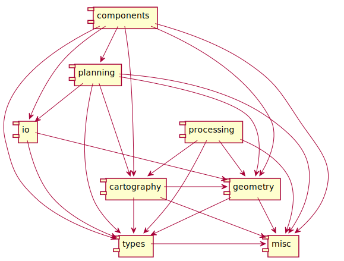

# arolib


[[_TOC_]]

`arolib` is a c++ library for field geometry processing and (global) route planning of primary machines (e.g. harvesters) and service units (e.g. overload/transport vehicles) participating in arable farming operations such as harvesting.








## Overview


### Modules
`arolib` currently consists of the following modules:

- `types`: defines the basic types
- `components`: higher level components used for the overall planning process
- `geometry`: includes classes and functions for geometry processing
- `planning`: Includes the components used for route planning
- `cartography`: includes the definitions and functionality related to gridmaps
- `io`: input/output components to read and write arolib types in files.
- `misc`: common classes and functions
- `processing`: post-planning processing functions like route smoothing

Dependencies between the modules:




### Main types
- `Point`: Point/coordinates

- `Polygon`: Simple polygon 

- `Linestring`: Line-string of points

- `Pose2D`: A 2D Cartesian pose containing a position and an angle (with respect to the positive x axis)

- `Machine`: Models a machine; contains properties of the machine such as model, type, dimensions, etc.

- `MachineDynamicInfo`: Dynamic properties of a single machine instance, including location and bunker mass

- `Field`: Represents a field consisting of one or more subfields. A valid field will have a boundary and at least one valid subfield (currently, only one subfield is supported for planning)

- `Subfield`: Represents a part of a `Field`; contains properties such as boundaries, track reference lines, access points, resource points, tracks, etc. A valid subfield has a outer boundary and at least one reference line for (inner field) tracks.

- `Headlands`: The headland(s) of one subfield; each subfield has either a `CompleteHeadland` which surrounds the whole subfield or a number of `PartialHeadland` located at some sides.

- `Track`: defines a track (lane)

- `FieldAccessPoint`: Field entry/exit point

- `ResourcePoint`: Models a process resource point. Currently, only unloading facilities are supported (e.g. silos, clamps). 

- `OutFieldInfo`: Contains information of activities/transit done outside of the field (e.g. transit between field access points and resource points located outside of the field)

- `RoutePoint`: A point in a route containing spatio-temporal and operation-specific information.

- `Route`: Route for a specific machine.

- `HeadlandRoute`: Route within the headland.

- `GridMap<T>`: models a gridmap with cell values of type T. 

- `IEdgeCostCalculator`: Interface (abstract class) used by the planners to obtain edge costs. 

- `IEdgeSpeedCalculator`: Interface (abstract class) used by the planners to compute the speed of a machine droving between two points. 

- `IEdgeMassCalculator`: Interface (abstract class) used by the planners to obtain the amount of mass under a rectangle. 

- `Logger`: Logging class. 

- `Unit`: Represents a unit (e.g  m^2, m/s, etc) supported in the library.

  

### Main terms

- Headland (HL): area of the subfield used by the machines for turning. Can be an area surrounding the main area of the subfield, or could be located only at some sides of the subfield.

- Inner-field (IF): main area of the subfield (the subfield excluding the headland)

- Working group: set of machines participating in the operation

  


### Documentation

To generate the documentation for the C++ code, run `doxygen` in the base directory:

```
doxygen Doxyfile
```

The documentation will be generated in the `/docs` subdirectory. You can start browsing from `/docs/html/index.html`.


## Set up


### Requirements

1. Install dependencies

   * On **Linux** the dependencies can simply be installed by running the script '`scripts/install_deps.sh`'. 

     

### Variables

The following variables are used by the package scripts:

* `AROLIB_AROLIB_ROOT`: directory where the source code is located. If not set, many scripts will set the default relative to the script's directory (hence the location of the scripts is important)

* `AROLIB_AROLIB_BUILD_PATH` : directory where the built files will be located. Default: `$HOME/AROLIB_AROLIB_ROOT/build`

* `AROLIB_AROLIB_INSTALL_PATH`: directory where the installation files will be located. Default: `$HOME/arolib/install/arolib`

  

### Building & Installation
Open a new terminal. Before building,  set the aforementioned variables if/as desired (`AROLIB_AROLIB_ROOT`, `AROLIB_AROLIB_BUILD_PATH` , `AROLIB_AROLIB_INSTALL_PATH`) : 

Currently there are 3 different ways to build/install arolib:

1. Using the available script `scripts/arolib_make`

        cd $AROLIB_AROLIB_ROOT
        ./scripts/arolib_make

    Notes:

    * If `AROLIB_AROLIB_ROOT` is not set, it will be set relatively based on the absolute path of the script (hence the location of the script is important)
    * If `AROLIB_AROLIB_INSTALL_PATH` is not set, it will be set to the default path `$AROLIB_AROLIB_ROOT/build`
    * If `AROLIB_AROLIB_INSTALL_PATH` is not set, it will be set to the default path `$HOME/arolib/install`
    * Run the script `./scripts/arolib_make_debug` to build/install the debug version.

2. Using `make`

        cd $AROLIB_AROLIB_ROOT
        make build

3. Docker alternative (should also work on windows with some adjustments)

        cd $AROLIB_AROLIB_ROOT
        sudo make docker/build_image
        sudo -E make docker/build_arolib

    The option `-E` for `sudo` passes on the session's environment variables

The installed libraries and headers will be located in `AROLIB_AROLIB_INSTALL_PATH`.


### Testing

Before running the tests, make sure that the environmental variable `AROLIB_AROLIB_ROOT` is set to the directory where the arolib source files are located. Running the script `scripts/env.sh` will set it.

Running the unit tests:

```
    cd $AROLIB_AROLIB_ROOT
    make test/units
```

Running the integration test:

```
    cd $AROLIB_AROLIB_ROOT
    make test/integration
```

Running both tests together:

```
    cd $AROLIB_AROLIB_ROOT
    make test
```


### Using the library

To use the library, the installation sub paths must be added to the system environmental variables. For this, the script `scripts/env_install_dir.sh` is available. This script receives one argument: the path where arolib was installed (without the final '/'). For example:

```
export AROLIB_AROLIB_INSTALL_PATH=$HOME/arolib/install
source scripts/env_install_dir.sh $AROLIB_AROLIB_INSTALL_PATH
```

*  Add '`source <arolib_arolib_src_directory>/scripts/env_install_dir.sh <arolib_install_path>`'' to your '`~/.bashrc`' if desired

The script `scripts/env.h` can also be used for this purpose. This script will set a default value for `AROLIB_AROLIB_INSTALL_PATH` (if not set before), and add the respective paths to the system environmental variables.

```
# export AROLIB_AROLIB_INSTALL_PATH=<arolib_install_path> ##optional
source scripts/env.sh
```

*  Add '`source <arolib_arolib_src_directory>/scripts/env.sh `'' to your '`~/.bashrc`' if desired (`AROLIB_AROLIB_INSTALL_PATH` must be set before)


## Usage


### Planning with arolib


#### General input parameters

In order to plan with the `arolib` components, some parameters must be set by the user. This parameters are used by one or more of the planning components. All geometries must be given in the Cartesian coordinate system (geodetic coordinates must be transformed/projected accordingly, e.g. by using the available `CoordTransformer` type)

* **Field**: 

  A (virgin) field must be set, containing the outer boundary and at least one subfield (currently, only one subfield is supported). The subfields must contain the outer boundary, at least one reference linestring for the inner-field tracks, access points, and resource points. The field can be initialized directly by the user, or read using the i/o methods (xml, kml, hdf5) offered by `arolib` (the files must follow the `arolib` data structure).

* **Working group**: 

  The group of machines that will participate in the operation must be given. This group must contain one harvester and, if the harvester has no capacity, one or more overload (transport) vehicles.

* **Out-of-field information**: 

  Information of the operations done outside of the field must be given. This includes:

  * Travel distance and durations between access points and (external) resource points (general or specific for a machine)
  * Travel distance and durations between (external) resource points and access points (general or specific for a machine)
  * Travel distance and durations between access points (general or specific for a machine)
  * Travel distance and durations between the current location of each machine and each access point (if the machine is outside the field)
  * Unloading durations for the resource points  (general or specific for a machine)

* **Machine's current states**: 
  * The currents state (location, bunker mass) of the participating machines

* **Edge calculators**:  

  Several planning components use edge calculators to compute some values related to a segment driven by a machine. Default calculators are available in `arolib`, however, the user can define specific calculators following the respective interfaces.

  * **Harvesting-speed calculator:** This calculator must inherit from `IEdgeSpeedCalculator`. It is used by some planners to compute the speed of the harvesters while harvesting based on the machine and the (2-point) segment to be driven.
  * **Mass calculator:** This calculator must inherit from `IEdgeMassCalculator`. It is used by some planners to compute the amount of mass under a rectangle given by a (2-point) segment and a width.
  * **Cost calculator:** This calculator must inherit from `IEdgeCostCalculator`. It is used by the A* path planners to compute the edge cost and heuristics. It can be defined based on the desired optimization criterion for the operation.

* **Grid-maps**:  

  Some planners or edge calculators might need some gridmaps to operate. For Instance, a mass calculator might need a field biomass gridmap to obtain the amount of mass in a certain region. 

  

#### Planning steps

The following steps must be followed to plan the process in a virgin field based on the given input parameters.

1. **Plan the headland:** 

   The first step is to generate the geometries of the subfield corresponding to the headland. For this, the component `HeadlandPlanner` is used. The planner will generate the headland boundary, the subfield inner-boundary, and headland tracks based on the given `HeadlandPlanner::PlannerParameters`. If a set of machines containing a primary machine (harvester) is given, the planner will also generate the  base-route for the headland based on the edge mass calculator and edge speed calculator.

2. **Generate the inner-field tracks:**

   The component `TracksGenerator` is used to generate the inner-field tracks based on the given `TracksGeneratorParameters` and a reference linestring. 

3. **Generate the base-route for the inner-field**

   Based on the generated geometries, the base-route for the harvester is computed using the component `BaseRoutesInfieldPlanner`. The base-route is the route that the harvester would follow to cover the field without taking into account capacity constraints and overloading windows. This route is generated based on the given  `BaseRoutesInfieldPlanner::PlannerParameters` , edge mass calculator, and edge speed calculator.

4. **Connect the base-routes**

   The base-routes of the headland and the inner-field are connected using the component `BaseRoutesProcessor`to obtain the overall base-route for the harvester. 

5. **Build the graph**

   Based on the field geometries (boundaries, tracks, access points, resource points), out-of-field information, current state of the machines, and the computed base-route, the component `GraphProcessor` is used to build the graph that will be used by the path planners.

6. **Plan the routes for the process**

   Finally, the routes for all machines are generated using the component `FieldProcessPlanner`, based on the given `FieldProcessPlanner::PlannerParameters`. 

7. **(Optional) Smoothen the routes**

   The routes can be smoothen based on the machines' turning radius using the `RouteSmoother` (in  `processing`)

8. **(Optional) Simulation**

   The component `GPSSimulator` can be used to simulate the computed routes.


### Examples

In `examples/example_harvesting` you can find a simple example demonstrating the usage of `AroLib`.


## Used libraries

| Library                                                      | License                                                      |
| ------------------------------------------------------------ | ------------------------------------------------------------ |
| [boost](https://www.boost.org/)                              | [Boost Software License](https://www.boost.org/users/license.html) |
| [GDAL](https://gdal.org/index.html)                          | [MIT/X style license](https://gdal.org/license.html)         |
| [HDF5](https://hdfgroup.org/solutions/hdf5/)                 | [BSD-style](https://support.hdfgroup.org/ftp/HDF5/releases/COPYING) |
| [HighFive](https://github.com/BlueBrain/HighFive)            | [Boost Software License 1.0](https://github.com/BlueBrain/HighFive/blob/master/LICENSE) |
| [crypto++](https://www.cryptopp.com/)                        | [Boost Software License 1.0](https://www.cryptopp.com/License.txt) |
| [Dubins-Curves](https://github.com/AndrewWalker/Dubins-Curves) | [MIT](https://github.com/AndrewWalker/Dubins-Curves/blob/master/LICENSE.txt) |
| [Bezier](https://github.com/oysteinmyrmo/bezier)             | [MIT](https://github.com/oysteinmyrmo/bezier/blob/master/LICENSE.txt) |
| [Clipper](http://www.angusj.com/delphi/clipper.php)          | [Boost Software License 1.0](https://www.boost.org/LICENSE_1_0.txt) |
| [Spline](https://github.com/brainexcerpts/Spline)            | [MIT](https://github.com/brainexcerpts/Spline/blob/master/LICENSE) |
| [cmake](https://cmake.org)                                   | [BSD 3-clause License](https://cmake.org/licensing/) |


## Funding information

`arolib` was developed in part within the following funded projects:

| Project                                                      | Sponsor                                                      | Funding code(s)      |
| ------------------------------------------------------------ | ------------------------------------------------------------ | -------------------- |
| [prospective.HARVEST](https://www.prospectiveharvest.de/de/startseite.html) | German Federal Ministry of Food and Agriculture ([BMEL](https://www.bmel.de/EN/Home/home_node.html)) | 2815700915           |
| [SOILAssist](https://www.soilassist.de/en/)                  | German Federal Ministry of Education and Research ([BMBF](https://www.bmbf.de/bmbf/en/home/home_node.html)) | 031A563B / 031B0684B |


